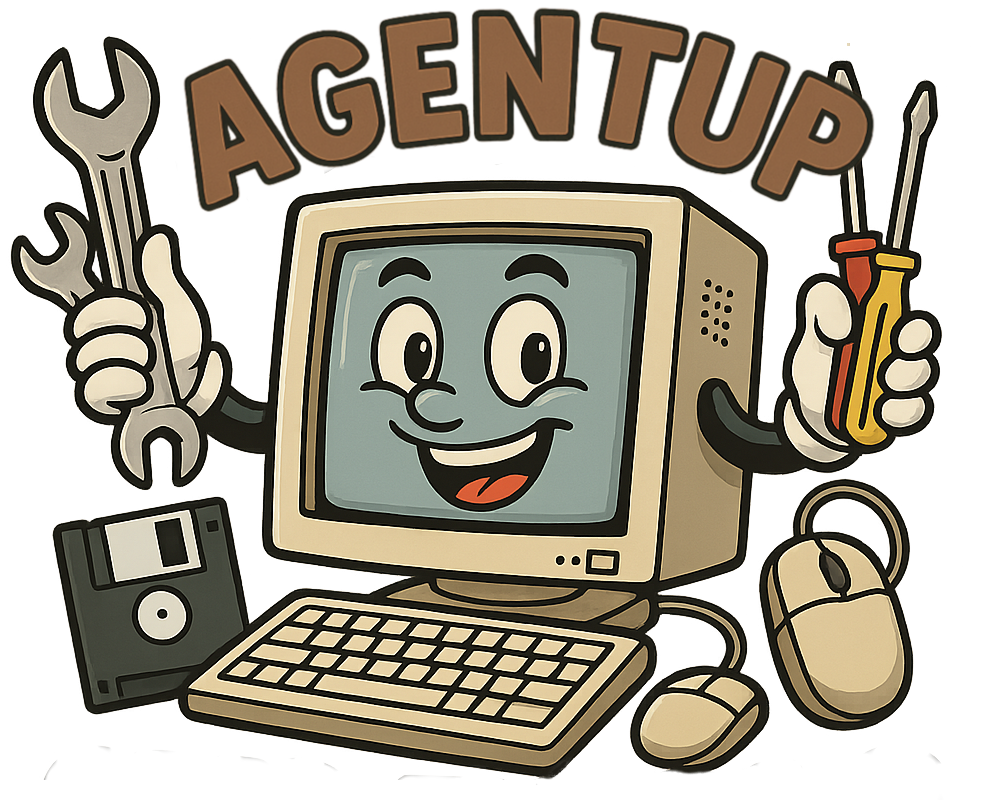

# AgentUp

<p align="center">
  
</p>

[](https://opensource.org/licenses/Apache-2.0)
|
[](https://github.com/RedDotRocket/AgentUp/actions/workflows/ci.yml)
|
[![Discord][badge-discord-img]][badge-discord-url]
|
[](https://pypi.org/project/AgentUp/)
|
[](https://pepy.tech/project/agentup)


## Core Philosophy

AgentUp combines the speed of a configuration‑driven framework with the flexibility of a plugin ecosystem - giving you the best of both worlds. With AgentUp, you:

* **Spin up agents in minutes**
  Define behavior, data sources and workflows entirely through configuration, no boilerplate, no deep dives into framework internals.

* **Extend on demand**
  Install community‑built plugins or author your own to introduce new capabilities - custom logic lives outside the core engine, yet inherits all of AgentUp’s middleware and features.

* **Stay consistent at scale**
  Because your agents share the same core and configuration patterns, deployments remain predictable and 'config-as-code' portable across teams and environments. Plugins can be versioned independently, and pinned as dependencies, allowing you to automate updates within your CI/CD pipeline.

AgentUp gets you moving fast today, yet able to evolve and adapt tomorrow.


## Feature-Rich, Out of the Box

AgentUp aims to provide everything you need to build production-ready AI agents
without the guesswork. Its middleware handles rate limiting, caching, authentication, and more.

### Core Features

**Plugin System**
- Build AgentUp's plugin architecture:
  - Create custom capabilities without modifying core code
  - Leverage community plugins from the open ecosystem (system tools, image processing, etc.)
  - Manage plugins with your existing package manager (pip, uv, poetry, etc.)
  - All plugins are gated by capabilities scopes, ensuring secure access control using domain-specific permissions
  - No more back port hell , version migration, or breaking change nightmares!

**Security & Access Control**
- Built-in authentication, authorization, and secure communication patterns
- Granular permission management through scope hierarchy:
  - Control exactly what each plugin can access
  - Seamless integration with OAuth2 and bearer token systems
  - Fine-tune capabilities at every level

**State Management**
- Track conversations persistently with configurable TTL and history
- Choose your storage backend to match your infrastructure:
  - File system for simple deployments
  - Database for structured queries
  - Redis or Valkey for high-performance caching

**Asynchronous Operations**
- Manage long-running tasks with built-in state tracking
- Push notifications for real-time updates
- Non-blocking execution for better performance

**Agent Discovery**
- Enable agent-to-agent communication through A2A Agent Cards
- Make your agents discoverable and interoperable
- Build multi-agent systems with ease

**AI Provider Flexibility**
- Connect to multiple AI providers without changing your code:
  - OpenAI for GPT models
  - Anthropic for Claude
  - Local models through OpenAI-compatible APIs (Ollama)

**MCP Integration**
- Leverage the growing MCP ecosystem as a client:
  - All MCP servers are gated by capabilities scopes
  - Easily add AgentUp Authentication
  - Expose AgentUp capabilities as MCP endpoints

**CLI-Driven Development**
- Scaffold, develop, and deploy agents entirely from the command line:
  - `agentup agent create` - Create new agents from templates
  - `agentup agent serve` - Start a local development server
  - `agentup plugin` - Generate, install, and cookiecutter new plugin projects

**Open Standards**
- AgentUp is built inline with the A2A (Agent-to-Agent) specification.
- Follows the MCP (Model Context Protocol) standard for MCP server and client protocols.
- Apache 2.0 licensed, so you can use it in your projects without restrictions.

## Project Status

AgentUp is in active development and not yet ready for production use. There will be lots of bugs, Type based coverage needs improvement, and the API is still evolving. Lot's of help is appreciated, and I welcome...

## Contributions

AgentUp is an open-source project, and contributions are welcome! Whether you're a developer, designer, or just someone who loves AI agents, your input can help shape the future of this framework.

I could do with lots of help, so if you are interested in helping, please get in touch! I always
value contributions, whether they are code, documentation, or just feedback on the project. You can also
show your support by starring the project on GitHub...

## ⭐ Show Your Support

If you find this project useful or interesting, please consider giving it a star! It helps me know that people are finding value in this work and motivates me to keep improving it.

[](https://github.com/RedDotRocket/AgentUp)

## Quick Start

### Installation

Install AgentUp using pip:
```bash
pip install agentup
```

### Creating Agents

Generate a new agent project with interactive configuration:
```bash
agentup agent create my-agent
cd my-agent
```

Select from available options.

### Starting Development

Launch the development server:
```bash
agentup agent serve
```

Your agent runs at `http://localhost:8000`

From here, you really should read the [documentation](https://agentup.readthedocs.io/en/latest/) to understand how to configure your agent, add plugins, and customize its behavior, there are lots of examples and guides to help you get started!


## License

This project is licensed under the Apache 2.0 License.

## Community

Report bugs and request features through [GitHub issues](https://github.com/RedDotRocket/AgentUp/issues). 

Join the discussion on [Discord](https://discord.gg/pPcjYzGvbS).


[badge-discord-img]: https://img.shields.io/discord/1384081906773131274?label=Discord&logo=discord
[badge-discord-url]: https://discord.gg/pPcjYzGvbS